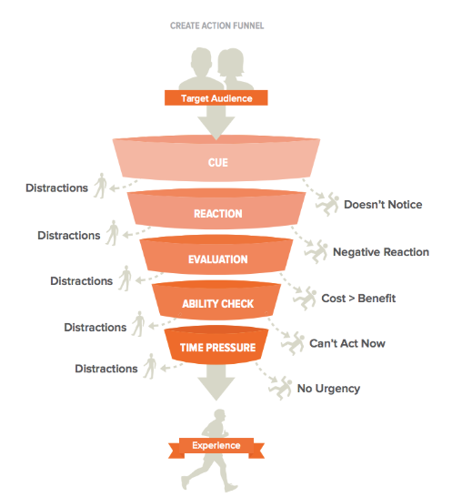

# Stephen Wendel’s CREATE Action Funnel

The **CREATE Action Funnel** is a behavioral design framework developed by Stephen Wendel to help individuals or organizations encourage specific behaviors, particularly in product design. It outlines six key stages that guide users from intention to action, helping designers identify and address barriers effectively.

---

  

## The Six Stages of the CREATE Action Funnel

1. **CUE**

   - The user must notice a cue or prompt that signals them to act.
   - Examples: Notifications, visual elements, or reminders.

2. **REACTION**

   - The user must react positively to the cue.
   - This involves emotional and cognitive processing to determine if the action is relevant or attractive.

3. **EVALUATION**

   - The user evaluates whether the action is worth their time, energy, or resources.
   - They assess the benefits against the effort required.

4. **ABILITY**

   - The user must feel capable of performing the action.
   - Designers should ensure the action is simple and aligns with the user’s skills and available resources.

5. **TIMING**

   - The action must occur at the right time.
   - Users need to have the opportunity and be in the appropriate context to act.

6. **EXECUTION**
   - The behavior is successfully carried out.
   - This is the final stage where the desired action is completed.

---

## Applications of the CREATE Action Funnel

The CREATE Action Funnel is a valuable tool for:

- **Product Designers**: To design user-friendly interfaces and workflows.
- **Marketers**: To craft campaigns that drive engagement.
- **Behavior Change Professionals**: To develop strategies that bridge the gap between intention and action.

By systematically analyzing each stage, the funnel helps identify where users might drop off and provides insights to address these pain points. This structured approach improves completion rates and ensures a seamless user experience.

---

## Key Benefits

- **Improved User Engagement**: By addressing barriers at each stage.
- **Actionable Insights**: Pinpoints specific areas to optimize for better outcomes.
- **Behavioral Understanding**: Provides a framework for understanding the gap between intention and action.

The CREATE Action Funnel is a practical and effective tool for driving meaningful behavior change in a variety of contexts.
